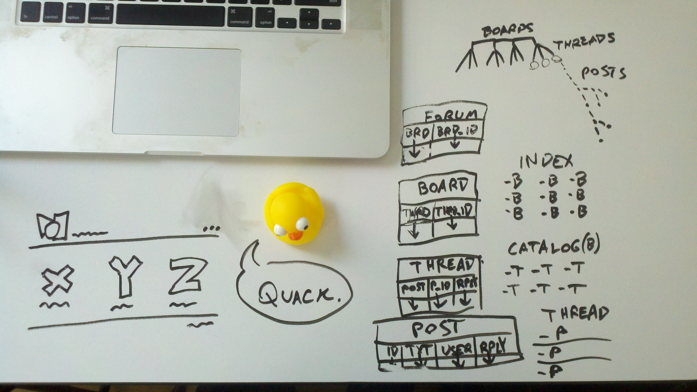
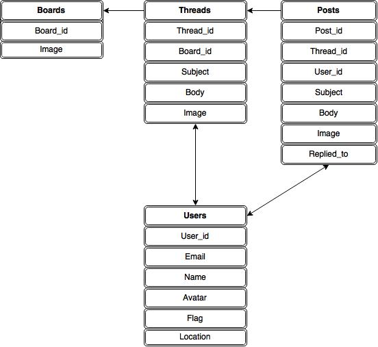

# Multi-User Message Board: Working Title

##Objective

To create a comfortable and efficient place for discussion and the exchange of ideas. Emphasis must be on usability, clear formatting, and intuitive display of information.

## Current Features

- Users should be able to select from a number of sub-forums for a range of topics.
- Users should be able to view a catalog of threads within each sub-forum.
- Users should be able to create their own threads with a subject and image.
- Users should be able to **shitpost relentlessly** in other users' threads until the internet collapses under the sheer weight of their idiocy.
- Users should be able to enter a name attached to each post and thread.
- Users should be able to immediately see where the activity is by the catalog sorting by bump order.
- Users should be able to link images and gifs to their posts.

## Planned Features

- Users should be able to see the flag of the home country of other users.
- Users should have the option to write their posts in markdown format.
- Users should have the option of custom color schemes.
- Users should have their Gravatar displayed according to their e-mail input.
- Users should be able to upload image files alongside their posts (?).
- Users should be able to adjust settings for how their posts are displayed (?).
- Users should be able to create their own sub-forums (?).
- Users should be able to embed youtube and soundcloud links in their posts (?).

###Footnote on Rating Threads

The absence of this feature is based on a philosophical objection more than a design objection. Whereas it is one thing to be able to register your disapproval of a particular idea and evaluate the collective disapproval of your peers via a rating system, the ability to censor, en masse, conflicting points of view by way of "downvotes" is one of the most profoundly harmful concepts to be introduced to the internet since microtransactions. It turns an open forum into an echo chamber tirelessly patrolled by self-appointed thought police and the end result will be a race of squealing infants who cower and go limp at their first introduction to an uncomfortable opinion. If Reddit becomes our default mode of interaction, then the sacred and profane potential of the internet and our great experiment in free speech and the unregulated flow of ideas in a global community may well come to an end.
